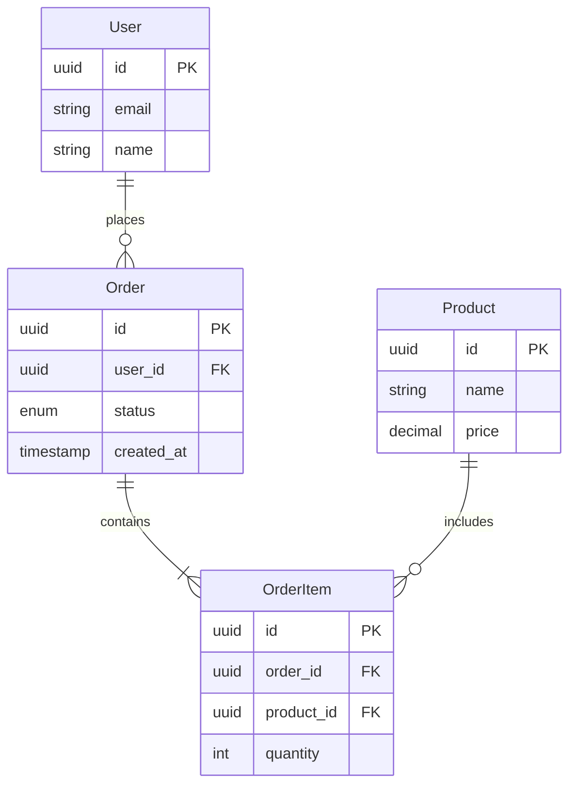

# 数据建模技能

## 技能定义
设计数据模型的能力，包括概念模型、逻辑模型和物理模型。

## 适用场景
- 新系统数据设计
- 数据库优化
- 数据迁移规划
- API数据结构设计

## 执行流程

### 1. 需求理解
- 业务实体识别
- 关系分析
- 数据规模预估

### 2. 概念建模
- 实体定义
- 属性识别
- 关系确定

### 3. 逻辑建模
- 表结构设计
- 主外键定义
- 范式化/反范式化

### 4. 物理建模
- 索引策略
- 分区方案
- 存储优化

## 输出格式
```markdown
## 数据模型设计

### 业务背景
[业务描述]

### 概念模型



### 逻辑模型

#### users 表
| 字段 | 类型 | 约束 | 说明 |
|------|------|------|------|
| id | UUID | PK | 主键 |
| email | VARCHAR(255) | UNIQUE, NOT NULL | 邮箱 |
| name | VARCHAR(100) | NOT NULL | 姓名 |
| status | ENUM | NOT NULL | 状态 |
| created_at | TIMESTAMP | NOT NULL | 创建时间 |
| updated_at | TIMESTAMP | NOT NULL | 更新时间 |

#### orders 表
| 字段 | 类型 | 约束 | 说明 |
|------|------|------|------|
| id | UUID | PK | 主键 |
| user_id | UUID | FK(users) | 用户ID |
| status | ENUM | NOT NULL | 订单状态 |
| total | DECIMAL(10,2) | NOT NULL | 总金额 |
| created_at | TIMESTAMP | NOT NULL | 创建时间 |

### 索引设计
| 表 | 索引名 | 字段 | 类型 | 用途 |
|-----|--------|------|------|------|
| users | idx_email | email | UNIQUE | 登录查询 |
| orders | idx_user_created | user_id, created_at | BTREE | 用户订单列表 |
| orders | idx_status | status | BTREE | 状态筛选 |

### 分区策略
- 表: orders
- 方式: 按月范围分区
- 字段: created_at
- 保留: 24个月

### 数据字典

#### 订单状态枚举
| 值 | 说明 |
|-----|------|
| PENDING | 待支付 |
| PAID | 已支付 |
| SHIPPED | 已发货 |
| COMPLETED | 已完成 |
| CANCELLED | 已取消 |

### 数据量预估
| 表 | 日增量 | 年增量 | 存储预估 |
|-----|--------|--------|----------|
| users | 1000 | 365K | 50GB |
| orders | 10000 | 3.6M | 200GB |
```

## 设计原则

### 范式化 vs 反范式化
| 场景 | 建议 |
|------|------|
| OLTP系统 | 第三范式 |
| 查询优化 | 适度反范式 |
| 报表系统 | 宽表设计 |

### 主键选择
| 类型 | 优点 | 缺点 | 适用 |
|------|------|------|------|
| 自增ID | 简单、有序 | 暴露业务量 | 内部系统 |
| UUID | 分布式友好 | 无序、占用大 | 分布式 |
| UUID v7 | 有序UUID | 相对较新 | 推荐 |
