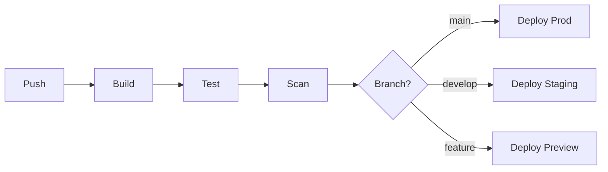

# CI/CD 技能

## 技能定义
设计和实现持续集成/持续部署流水线的能力。

## 适用场景
- 新项目CI/CD搭建
- 流水线优化
- 部署策略设计
- 自动化测试集成

## 执行流程

### 1. 需求分析
- 项目类型
- 部署目标
- 质量要求

### 2. 流水线设计
-
- 可靠性提升
- 反馈改进

## 输出格式
```markdown
## CI/CD 方案

### 流水线概览


### 阶段详情

#### 1. Build 阶段
- 触发: Push / PR
- 任务:
  - 依赖安装
  - 代码编译
  - Docker构建
- 时长: ~2min
- 产物: Docker镜像

#### 2. Test 阶段
- 并行任务:
  - 单元测试 (Jest)
  - 集成测试 (Cypress)
  - 类型检查 (tsc)
- 时长: ~5min (并行)
- 覆盖率要求: >80%

#### 3. Scan 阶段
- 安全扫描 (Snyk)
- 代码质量 (SonarQube)
- 时长: ~3min

### GitHub Actions 配置

```yaml
name: CI/CD

on:
  push:
    branches: [main, develop]
  pull_request:
    branches: [main]

jobs:
  build:
    runs-on: ubuntu-latest
    steps:
      - uses: actions/checkout@v4
      - uses: actions/setup-node@v4
        with:
          node-version: '20'
          cache: 'npm'
      - run: npm ci
      - run: npm run build
      - uses: docker/build-push-action@v5
        with:
          push: true
          tags: app:${{ github.sha }}

  test:
    needs: build
    runs-on: ubuntu-latest
    strategy:
      matrix:
        test: [unit, integration]
    steps:
      - uses: actions/checkout@v4
      - run: npm ci
      - run: npm run test:${{ matrix.test }}

  deploy:
    needs: [build, test]
    if: github.ref == 'refs/heads/main'
    runs-on: ubuntu-latest
    steps:
      - run: |
          # Deploy to production
```

### 部署策略
| 环境 | 策略 | 审批 | 回滚 |
|------|------|------|------|
| Dev | 直接部署 | 无 | 自动 |
| Staging | 直接部署 | 无 | 手动 |
| Prod | Canary | 手动 | 自动 |

### 监控与告警
- 构建失败: Slack通知
- 部署成功: Slack + 邮件
- 性能下降: PagerDuty

### 优化建议
| 优化项 | 当前 | 目标 | 方法 |
|--------|------|------|------|
| 构建时间 | 5min | 2min | 缓存优化 |
| 测试时间 | 10min | 5min | 并行化 |
```

## 最佳实践

### 流水线原则
- 快速反馈 (< 10min)
- 并行执行
- 增量构建
- 缓存复用

### 分支策略
| 分支 | 部署目标 | 自动化 |
|------|----------|--------|
| feature/* | Preview | 自动 |
| develop | Staging | 自动 |
| main | Production | 手动触发 |
