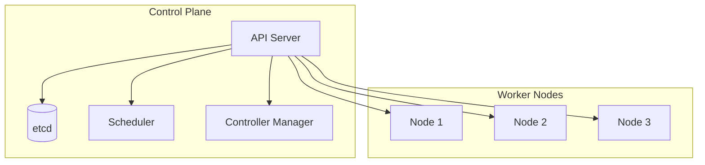

# Kubernetes 技能

## 技能定义
设计和管理Kubernetes集群及应用部署的能力。

## 适用场景
- K8s集群规划
- 应用容器化部署
- 资源管理优化
- 故障排查

## 执行流程

### 1. 需求分析
- 应用架构
- 资源需求
- 可用性要求

### 2. 架构设计
- 集群规划
- 网络设计
- 存储方案

### 3. 部署配置
- 资源定义
- 配置管理
- 服务发现

### 4. 运维管理
- 监控告警
- 扩缩容
- 故障处理

## 输出格式
```markdown
## Kubernetes 方案

### 集群架构


### 命名空间规划
| Namespace | 用途 | 资源配额 |
|-----------|------|----------|
| production | 生产应用 | 高 |
| staging | 预发布 | 中 |
| monitoring | 监控组件 | 中 |
| ingress | 入口控制 | 低 |

### Deployment 配置

```yaml
apiVersion: apps/v1
kind: Deployment
metadata:
  name: api-server
  namespace: production
spec:
  replicas: 3
  selector:
    matchLabels:
      app: api-server
  template:
    metadata:
      labels:
        app: api-server
    spec:
      containers:
      - name: api
        image: api-server:v1.0.0
        ports:
        - containerPort: 8080
        resources:
          requests:
            cpu: "100m"
            memory: "128Mi"
          limits:
            cpu: "500m"
            memory: "512Mi"
        livenessProbe:
          httpGet:
            path: /health
            port: 8080
          initialDelaySeconds: 30
          periodSeconds: 10
        readinessProbe:
          httpGet:
            path: /ready
            port: 8080
          initialDelaySeconds: 5
          periodSeconds: 5
```

### Service 配置

```yaml
apiVersion: v1
kind: Service
metadata:
  name: api-server
spec:
  selector:
    app: api-server
  ports:
  - port: 80
    targetPort: 8080
  type: ClusterIP
```

### HPA 配置

```yaml
apiVersion: autoscaling/v2
kind: HorizontalPodAutoscaler
metadata:
  name: api-server-hpa
spec:
  scaleTargetRef:
    apiVersion: apps/v1
    kind: Deployment
    name: api-server
  minReplicas: 3
  maxReplicas: 10
  metrics:
  - type: Resource
    resource:
      name: cpu
      target:
        type: Utilization
        averageUtilization: 70
```

### 资源规划
| 组件 | CPU | Memory | Replicas |
|------|-----|--------|----------|
| API | 500m | 512Mi | 3 |
| Worker | 1000m | 1Gi | 2 |
| Redis | 200m | 256Mi | 1 |

### 监控方案
- Metrics: Prometheus
- 日志: Loki
- 追踪: Jaeger
- 可视化: Grafana
```

## 常用命令

### 调试命令
```bash
# 查看 Pod 状态
kubectl get pods -n production

# 查看 Pod 日志
kubectl logs -f <pod-name> -n production

# 进入容器
kubectl exec -it <pod-name> -n production -- /bin/sh

# 查看资源使用
kubectl top pods -n production

# 描述资源
kubectl describe pod <pod-name> -n production
```

### 故障排查
```bash
# 查看事件
kubectl get events -n production --sort-by='.lastTimestamp'

# 查看节点状态
kubectl get nodes -o wide

# 查看服务端点
kubectl get endpoints -n production
```
