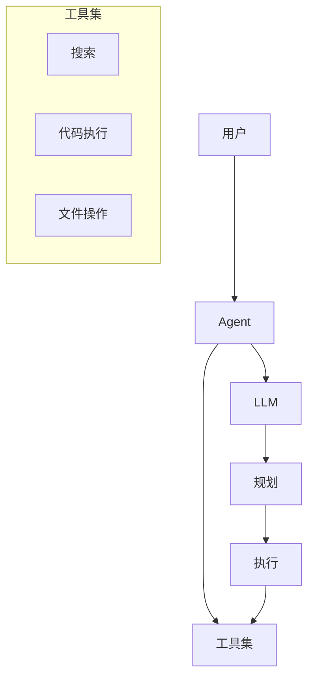
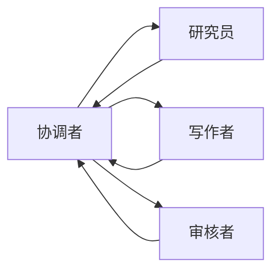

# Agent 设计技能

## 技能定义
设计和构建AI Agent系统的能力，包括工具使用、规划和自主执行。

## 适用场景
- AI Agent开发
- 工具集成设计
- 多Agent系统
- 自主任务执行

## 执行流程

### 1. 能力定义
- 任务范围
- 所需工具
- 约束条件

### 2. 架构设计
- 核心循环
- 工具接口
- 状态管理

### 3. 工具设计
- 工具定义
- 参数设计
- 错误处理

### 4. 评估优化
- 成功率测试
- 路径分析
- 持续优化

## 输出格式
```markdown
## Agent 设计文档

### Agent 定义
- 名称: [Agent名称]
- 目的: [核心目标]
- 能力边界: [能做/不能做]

### 架构设计



### 核心循环

```typescript
async function agentLoop(task: string) {
  const state = initState(task);
  
  while (!state.completed) {
    // 1. 思考
    const thought = await llm.think(state);
    
    // 2. 决策
    const action = await llm.decide(thought, tools);
    
    // 3. 执行
    if (action.type === 'tool') {
      const result = await executeTool(action);
      state.addObservation(result);
    } else if (action.type === 'answer') {
      state.complete(action.answer);
    }
    
    // 4. 检查限制
    if (state.steps > MAX_STEPS) {
      state.fail('Max steps exceeded');
    }
  }
  
  return state.result;
}
```

### 工具定义

#### search
```typescript
{
  name: "search",
  description: "搜索网络获取信息",
  parameters: {
    query: {
      type: "string",
      description: "搜索关键词"
    }
  },
  execute: async (params) => {
    // 实现
  }
}
```

#### execute_code
```typescript
{
  name: "execute_code",
  description: "执行Python代码",
  parameters: {
    code: {
      type: "string",
      description: "要执行的Python代码"
    }
  },
  execute: async (params) => {
    // 沙箱执行
  }
}
```

### 状态管理

```typescript
interface AgentState {
  task: string;
  thoughts: Thought[];
  actions: Action[];
  observations: Observation[];
  completed: boolean;
  result?: string;
}
```

### 安全约束
- 最大步数: 20
- 工具白名单
- 敏感操作审批
- 资源限制

### 评估指标
| 指标 | 目标 | 当前 |
|------|------|------|
| 任务成功率 | >80% | 75% |
| 平均步数 | <10 | 8 |
| 工具调用准确率 | >90% | 88% |
```

## Agent 模式

### ReAct 模式
```
Thought: 我需要...
Action: search("query")
Observation: 搜索结果...
Thought: 根据结果...
Action: finish("答案")
```

### Plan-Execute 模式
```
Plan:
1. 搜索相关信息
2. 分析数据
3. 生成报告

Execute:
- Step 1: 执行搜索...
- Step 2: 分析数据...
- Step 3: 生成报告...
```

### 多Agent协作


## 最佳实践

### 工具设计
- 单一职责
- 清晰描述
- 完善错误处理
- 幂等设计

### 提示词
- 明确任务边界
- 提供工具使用示例
- 设置退出条件

### 安全
- 沙箱执行
- 权限最小化
- 操作审计
- 资源限制
