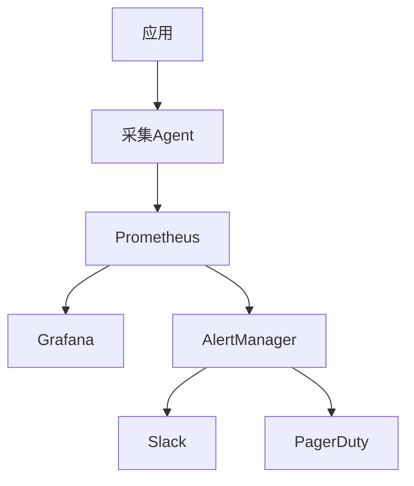

# 监控技能

## 技能定义
设计和实施系统监控方案的能力，确保系统可观测性。

## 适用场景
- 监控体系建设
- 告警策略设计
- 故障排查支持
- 性能分析

## 执行流程

### 1. 需求分析
- 监控目标
- 关键指标
- 告警需求

### 2. 方案设计
- 采集策略
- 存储方案
- 可视化设计

### 3. 实施部署
- 工具部署
- 仪表盘配置
- 告警配置

### 4. 持续优化
- 告警调优
- 覆盖扩展
- 容量规划

## 输出格式
```markdown
## 监控方案

### 监控架构


### 指标体系

#### 黄金指标 (Golden Signals)
| 指标 | 说明 | 阈值 |
|------|------|------|
| Latency | 请求延迟 | P99 < 200ms |
| Traffic | 请求量 | 监控趋势 |
| Errors | 错误率 | < 0.1% |
| Saturation | 资源饱和度 | < 80% |

#### RED 指标
| 指标 | 说明 | PromQL |
|------|------|--------|
| Rate | 请求率 | `rate(http_requests_total[5m])` |
| Errors | 错误率 | `rate(http_errors_total[5m]) / rate(http_requests_total[5m])` |
| Duration | 延迟 | `histogram_quantile(0.99, rate(http_duration_seconds_bucket[5m]))` |

### 仪表盘设计

#### 总览仪表盘
- 服务健康状态
- 错误率趋势
- 延迟分布
- 流量概览

#### 服务仪表盘
- QPS
- 延迟分位数
- 错误类型分布
- 依赖服务状态

### 告警策略

#### 告警规则
```yaml
groups:
  - name: api
    rules:
      - alert: HighErrorRate
        expr: |
          rate(http_errors_total[5m]) / rate(http_requests_total[5m]) > 0.01
        for: 5m
        labels:
          severity: critical
        annotations:
          summary: "High error rate"
          description: "Error rate is {{ $value | humanizePercentage }}"
          
      - alert: HighLatency
        expr: |
          histogram_quantile(0.99, rate(http_duration_seconds_bucket[5m])) > 0.5
        for: 5m
        labels:
          severity: warning
```

#### 告警分级
| 级别 | 响应时间 | 通知渠道 | 场景 |
|------|----------|----------|------|
| P0 Critical | 5min | PagerDuty | 服务宕机 |
| P1 High | 30min | Slack | 性能严重下降 |
| P2 Medium | 4h | Email | 异常趋势 |
| P3 Low | 24h | Ticket | 优化建议 |

### 日志策略
- 结构化日志 (JSON)
- 日志级别: ERROR/WARN/INFO/DEBUG
- 保留时间: 30天
- 索引字段: request_id, user_id, service

### 追踪配置
- 采样率: 1%
- 关键路径: 100%
- 保留时间: 7天
```

## 常用PromQL

```promql
# 请求率
rate(http_requests_total[5m])

# 错误率
sum(rate(http_requests_total{status=~"5.."}[5m])) / sum(rate(http_requests_total[5m]))

# P99延迟
histogram_quantile(0.99, sum(rate(http_request_duration_seconds_bucket[5m])) by (le))

# CPU使用率
100 - (avg by(instance) (rate(node_cpu_seconds_total{mode="idle"}[5m])) * 100)

# 内存使用率
(1 - node_memory_MemAvailable_bytes / node_memory_MemTotal_bytes) * 100
```
