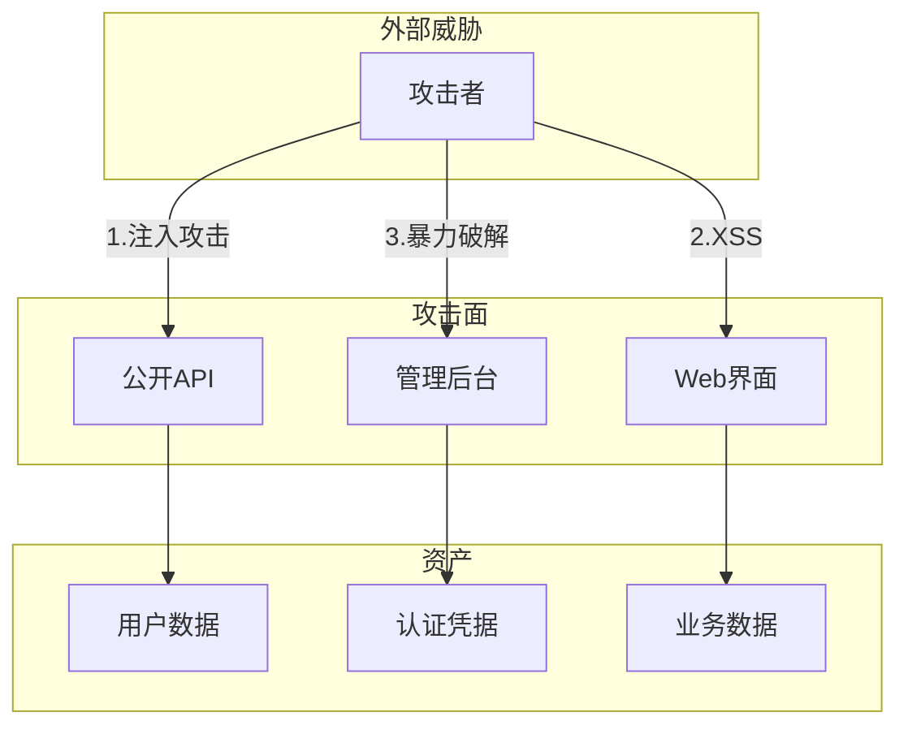

# 安全审查技能

## 技能定义
评估系统和代码安全性的能力，识别漏洞和风险。

## 适用场景
- 代码安全审查
- 架构安全评估
- 渗透测试前置
- 合规检查

## 执行流程

### 1. 信息收集
- 系统架构
- 技术栈
- 数据流

### 2. 威胁建模
- 资产识别
- 威胁识别
- 风险评估

### 3. 安全测试
- 静态分析
- 动态测试
- 配置检查

### 4. 报告输出
- 漏洞清单
- 风险等级
- 修复建议

## 输出格式
```markdown
## 安全评估报告

### 评估范围
- 系统: [系统名称]
- 版本: [版本号]
- 评估日期: [日期]
- 评估类型: 代码审查 / 架构评估

### 威胁模型



### 漏洞清单

#### 严重 (Critical)
| ID | 漏洞 | 位置 | CVSS | 状态 |
|----|------|------|------|------|
| V001 | SQL注入 | /api/users | 9.8 | 待修复 |

**V001: SQL注入**
- 位置: `src/api/users.ts:42`
- 描述: 用户输入直接拼接到SQL语句
- PoC:
  ```
  GET /api/users?id=1' OR '1'='1
  ```
- 修复建议: 使用参数化查询
  ```typescript
  // Before
  const sql = `SELECT * FROM users WHERE id = '${id}'`;
  
  // After
  const sql = 'SELECT * FROM users WHERE id = $1';
  const result = await db.query(sql, [id]);
  ```

#### 高危 (High)
| ID | 漏洞 | 位置 | CVSS | 状态 |
|----|------|------|------|------|
| V002 | XSS | /profile | 7.5 | 修复中 |

#### 中危 (Medium)
| ID | 漏洞 | 位置 | CVSS | 状态 |
|----|------|------|------|------|
| V003 | CSRF | /settings | 5.5 | 待修复 |

### 安全配置检查

| 配置项 | 当前 | 建议 | 风险 |
|--------|------|------|------|
| HTTPS | ✅ | - | - |
| HSTS | ❌ | 启用 | 中 |
| CSP | ❌ | 启用 | 高 |
| Cookie Secure | ✅ | - | - |
| Cookie HttpOnly | ❌ | 启用 | 中 |

### 认证授权评估

| 检查项 | 状态 | 说明 |
|--------|------|------|
| 密码强度策略 | ✅ | 8位以上,含特殊字符 |
| MFA支持 | ❌ | 建议添加 |
| 会话超时 | ✅ | 30分钟 |
| 权限最小化 | ⚠️ | 部分API权限过宽 |

### 修复优先级

| 优先级 | 漏洞ID | 修复时间 |
|--------|--------|----------|
| P0 | V001 | 24小时内 |
| P1 | V002 | 1周内 |
| P2 | V003 | 2周内 |
```

## OWASP Top 10 检查清单

| 风险 | 检查项 |
|------|--------|
| 注入 | SQL/NoSQL/LDAP注入 |
| 认证失效 | 弱密码/会话管理 |
| 敏感数据泄露 | 加密/传输安全 |
| XXE | XML解析安全 |
| 访问控制 | 权限检查 |
| 配置错误 | 安全头/默认配置 |
| XSS | 输入验证/输出编码 |
| 反序列化 | 不可信数据反序列化 |
| 组件漏洞 | 依赖版本检查 |
| 日志监控 | 安全事件记录 |
