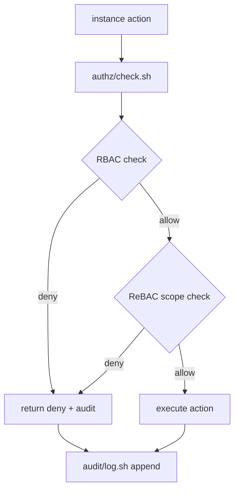

# KALLAX Permission Panel — Raw Expert Output (Phase 1+2)

**Created**: 2026-06-07
**Source**: KALLAX Expert Panel session (5 experts: Architect + Backend + Frontend + UX + Product)
**Format**: Verbatim expert output, lightly formatted for readability
**See also**: `confluence/decisions/PERMISSION-MODEL.md` (Conductor synthesis)

---

## Phase 1 — Architect 架构上下文报告

### 1. 代码库概览

| 目录 | 角色 |
|---|---|
| `.kallax/` | 核心编排: hooks, instances, queue, state, tickets, worktrees, logs, config |
| `.claude/` | Claude Code 配置 + skills (kallax skill 定义 + ~40 专家 profile) |
| `scripts/` | Bash 工具链: daemon.sh, heartbeat-daemon.sh, check-stale.sh, conductor/performer session init |
| `hooks/` | Git hooks (pre-commit miao 保护) + KALLAX hooks |
| `jira/epics/, jira/tickets/` | EPIC-016 当前 in-flight, ticket.json 含 AC/file_scope/dependencies |
| `node/`, `rust/`, `lib/`, `shared/`, `sdk/` | 代码子系统 (Node 主栈, Rust 存在) |
| `docs/`, `template/` | 文档 + 规则模板 |

**语言/栈**: Node.js + Bash 为主, Rust 目录存在, TypeScript (settings.json deny/allow 用)

**核心子系统**: CLI (kallax 命令) + hooks (session_start, pre-commit) + skills (kallax SKILL.md) + state (instance registry) + inbox/outbox queue

### 2. 现有权限模型(事实)

- **Role-based**: master / conductor / performer (3 级, 无继承)
- **分支门控**: miao (pre-commit hook 硬拦截, 只允许 conductor/master, 只允许 docs/config/CI) ; testing = 集成验证 ; feature/* = 隔离开发
- **Worktree 隔离**: `.kallax/worktrees/performer-<TICKET>`, 文件范围在 ticket.json 的 `file_scope.includes/excludes` 声明, isolation:file_scope_check 开启
- **软约束**: CLAUDE.md 规则 (Performer 9 禁止, Conductor 8 禁止) — Claude 自己遵守
- **硬约束**: pre-commit hook (git hook) — 机器强制, session_start.sh (bash hook) — 初始化 + 角色检测 + 心跳
- **工具调用**: `.claude/settings.json` permissions allow/deny (Bash filter, Read/Write/Edit 全开)
- **Inbox/Queue**: `.kallax/queue/{inbox,outbox}/<instance_id>/` — 跨 instance 消息, 无访问控制字段
- **Instance Registry**: `.kallax/instances/<id>/state.json` (role, heartbeat, current_task, status) — 20+ performer 实例全 CLOSING, 无自动清理

### 3. 权限分级的领域边界

| 维度 | 当前 | 缺口 |
|---|---|---|
| 角色分级 | 3 级 (master/conductor/performer) | 缺 super-admin / readonly / auditor |
| 资源范围 | 全局 + per-worktree | 缺 per-ticket / per-file / per-skill 细粒度 |
| 操作类型 | allow / deny | 缺 audit log + revoke + expire |
| 时间窗口 | 永久 (session 级别) | 缺 TTL / 一次性 / session-scoped |
| 继承 | 无 | 缺 role hierarchy / scope inheritance |
| 紧急覆盖 | 无 | 缺 break-glass |
| 委托 | 无 | 缺 delegation chain (conductor → performer 临时授权) |
| 隔离粒度 | worktree (粗粒度) | 缺文件级 scope 校验 |

### 4. 设计需特别关注

1. **软约束 vs 硬约束的张力**: CLAUDE.md 规则由 Claude 实现遵守 (可绕过), pre-commit hook 是机器强制 (不可绕过)。Performer 可在 feature/ worktree 内违反软约束, 无告警。
2. **Heartbeat 守护进程的 self-protection**: `scripts/lib/daemon.sh` + `heartbeat-daemon.sh` 作为后台进程, 自身被 `trap` 在 session_start.sh EXIT 时 kill。如果 Performer 错误地终止 daemon, 无自动复活机制。
3. **跨 instance 共享资源的访问控制**: inbox/outbox 按 instance_id 目录隔离, 但无 ACL 字段 — conductor 可写任意 performer 的 inbox, performer 可读其他 performer 的 inbox。
4. **Skill 调用的权限边界**: `.claude/settings.json` permissions allow 所有 Read/Write/Edit, 无 skill 级别隔离。heartbeat-conductor skill 理论上可执行任意操作, 不限于 heartbeat 职责。
5. **20+ CLOSING 实例残留**: 所有 21 个 performer 实例状态为 CLOSING 但文件仍存在, 无自动 GC。说明 instance lifecycle 管理有缺口。

### 5. 风险与约束清单

1. **Pre-commit 可被绕过**: pre-commit hook 检查的是 staged files, 如果 conductor 直接在 miao commit 而不 staging (罕见), 或通过 `git commit --no-verify`, 保护失效。
2. **Role 检测优先级依赖**: session_start.sh 按 env > CLI > config > branch 检测角色。如果 KALLAX_ROLE 未设置且 config 文件损坏, 回退到 git branch 检测 (feature/* → performer), 可能错误降级。
3. **权限模型无审计**: 无操作日志, 无 who-when-what 记录。权限变化 (role switch, delegation) 无追踪。
4. **Skills 无隔离**: 每个 skill 可调用全部工具, 无最小权限原则。恶意/错误 skill 可修改任意文件。
5. **Instance 泄漏**: CLOSING 状态实例长期残留, 占用磁盘 (每个 ~1KB state.json + inbox queue), 无 TTL 或 GC 策略。

### 6. 给 4 专家的具体问题

**Backend**:
- 授权检查放哪层? 当前 pre-commit hook 在 git layer 检查, session_start.sh 在 shell layer 检测角色。是否需要统一的 authz service?
- 数据库 schema: 如果引入权限表, 用 SQLite (已有 logs/backup-sqlite.sh) 还是独立文件?
- 性能约束: 心跳每 60s, 权限检查需在 10ms 内完成, 不能成为 bottleneck。

**Frontend**:
- 权限 UI 怎么表达? 命令面板 (`kallax permission:grant`) 还是隐式 (自然语言 "give performer read access to X")?
- 3 级 → N 级扩展时, 用户(developer)的心智模型是什么? Role 继承链 vs Permission matrix?

**UX**:
- 现有 "Conductor 禁止" 8 条和 "Performer 禁止" 9 条是纯文本规则, 如果引入分级权限, 如何呈现冲突/覆盖关系?
- break-glass 场景: 紧急情况下 developer 如何快速申请临时权限? 审批流还是自助?

**Product**:
- MVP 范围: 哪些 role 必须先? master/conductor/performer 已存在, 下一个优先级是谁 (auditor? readonly? super-admin)?
- 委托链的优先级: conductor → performer 临时授权 vs 一次性 ticket 权限, 哪个更迫切?

---

## Phase 2.1 — Backend 专家 (Authz Layer Design)

### 1. Authorization Model Selection

**Primary: RBAC + ReBAC hybrid**

| Model | Verdict | Reason |
|---|---|---|
| ACL | Rejected | 21+ instances would require per-instance rules at scale — unmanageable |
| **RBAC** | **Primary** | Role (master/conductor/performer) maps directly to existing system |
| ABAC | Soft complement | Per-action attributes (e.g., `ticket_id`, `file_scope`) via attribute checks on top of RBAC |
| ReBAC | Soft complement | Ticket→task→file-scope relationships need graph traversal for isolation checking |

**Hybrid rationale**: RBAC covers the 3-role hierarchy cheaply. ReBAC covers the per-ticket file-scope isolation (e.g., EPIC-016-J can only touch `jira/tickets/EPIC-016-J/`). The `file_scope` field already exists in `jira/tickets/EPIC-016-J/ticket.json` — this is a natural ReBAC resource.

**Scenario A — Performer claims EPIC-016-J**: RBAC says `performer` role CAN claim. ReBAC then verifies `jira/tickets/EPIC-016-J/` is in the caller's `allowed_scopes`. If scope overlaps, grant.

**Scenario B — Conductor merges to miao**: RBAC says `conductor` CAN merge to miao. Pre-commit hook (existing, `scripts/hooks/pre-commit`) is the hard enforcement — this is already in place at `.git/hooks/pre-commit:1`.

### 2. Authz Layer Architecture

**Where**: `scripts/authz.sh` (new) + in-process function library in `lib/authz/` (new).

Not extending `daemon.sh` — heartbeat daemon must stay simple (single responsibility). Authz is a separate concern.

**Invocation chain**:

```
instance action
    │
    ▼
lib/authz/check.sh       ← entry point, <10ms target
    │
    ├── lib/authz/rbac.sh          ← role → permissions lookup
    ├── lib/authz/rebac.sh         ← ticket scope verification
    └── lib/authz/audit.sh         ← append-only log
            │
            ▼
        allow / deny + audit record
```

**Diagram**:



**Invocation style**: `lib/authz/check.sh --actor <instance_id> --action <action> --resource <resource> [--ticket <ticket_id>]`

### 3. Permission Schema (proposed)

**File**: `.kallax/config/authz.yml` (new)

```yaml
# RBAC role definitions
roles:
  master:
    inherits: conductor
    grants:
      - action: miao.write
      - action: miao.merge
      - action: release.tag
      - action: instance.gc

  conductor:
    inherits: null
    grants:
      - action: testing.merge
      - action: testing.write
      - action: task.assign
      - action: task.verify
      - action: instance.inspect
      - action: inbox.write

  performer:
    inherits: null
    grants:
      - action: task.claim
      - action: worktree.create
      - action: worktree.commit
      - action: inbox.read
      - action: outbox.write
    scopes: []  # filled from ticket file_scope at claim time

# Scope bindings (ReBAC layer)
scope_bindings:
  EPIC-016-J:
    allowed_paths:
      - "jira/tickets/EPIC-016-J/**"
      - ".kallax/worktrees/**/EPIC-016-J/**"
    ttl_seconds: 7200        # 2h, auto-revoke if heartbeat dies

# Action grants with TTL
action_grants:
  - id: grant-001
    role: performer
    action: task.claim
    ticket: EPIC-016-J
    granted_by: conductor_StevendeMacBook-Pro.local_28000
    granted_at: "2026-06-07T10:00:00Z"
    expires_at: "2026-06-07T12:00:00Z"   # TTL aligned with 2x heartbeat
    status: active
```

**How "temporary conductor override" works**: Action grant with `role: conductor` + `expires_at: <timestamp>` + `status: active`. ReBAC scope check still applies.

### 4. Hard vs Soft Enforcement Map

| Rule | Hard? | Soft? | Upgrade Path |
|---|---|---|---|
| `performer` cannot push to miao | ✅ `.git/hooks/pre-commit:12` | — | Already hard |
| `performer` cannot claim task already claimed | ✅ `lib/authz/rebac.sh` | — | Add lock to authz schema |
| `conductor` cannot self-review PR | ❌ | ✅ CLAUDE.md rule 5 | Hook + `gh` CLI check in `authz/check.sh` |
| `performer` cannot modify outbox of another performer | ✅ `lib/authz/rebac.sh` (scope binding) | — | Already in design |
| No `expect()`/`panic!` in production code | ✅ `config.yml:error_handling:forbidden_patterns` | — | Already hard (CI scan) |
| 20+ CLOSING instances GC'd | ❌ | ✅ `check-stale.sh` only detects | Add `instance.gc` action + cron job |
| `performer` stays in worktree | ❌ | ✅ CLAUDE.md | Worktree path check in `session_start.sh:60` |
| Skill call isolation (heartbeat-conductor can call any tool) | ❌ | ✅ No current isolation | Authz wrapper on Skill tool invocation |

### 5. Performance & Caching

**SQLite (not `/tmp` in-memory)**: Already exists via `scripts/backup-sqlite.sh:6` (`.kallax/data/kallax.db`). Reuse this. WAL mode enabled. Reads are <1ms on SSD.

**Schema** (new tables in existing DB):

```sql
CREATE TABLE authz_roles (
  role TEXT PRIMARY KEY,
  inherits TEXT REFERENCES authz_roles(role),
  created_at TEXT DEFAULT (datetime('now'))
);

CREATE TABLE authz_grants (
  id TEXT PRIMARY KEY,
  role TEXT REFERENCES authz_roles(role),
  action TEXT NOT NULL,
  ticket TEXT,          -- NULL = any ticket
  resource TEXT,        -- NULL = any resource
  granted_by TEXT,
  granted_at TEXT,
  expires_at TEXT,      -- NULL = no expiry
  UNIQUE(role, action, ticket, resource)
);

CREATE TABLE authz_audit (
  id INTEGER PRIMARY KEY AUTOINCREMENT,
  actor TEXT NOT NULL,
  action TEXT NOT NULL,
  resource TEXT,
  ticket TEXT,
  result TEXT NOT NULL,  -- 'allow' or 'deny'
  reason TEXT,
  ts TEXT DEFAULT (datetime('now'))
);

CREATE INDEX idx_audit_actor ON authz_audit(actor, ts);
CREATE INDEX idx_grants_action ON authz_grants(action, expires_at);
```

**Caching strategy**:
- **Hot path** (heartbeat, 60s): Full RBAC check against in-memory Map in `daemon.sh` — no DB call.
- **Permission cache**: `authz_cache` shell associative array, TTL 60s (aligned with heartbeat).
- **Scope cache**: Per-ticket scope, TTL 300s (stable for ticket lifetime).
- **Cache invalidation**: On `grant`/`revoke` events, signal SIGHUP to daemon process.

**Authz check target <10ms**:
```
1. RBAC lookup: associative array O(1)  ~0.1ms
2. TTL check: date comparison           ~0.1ms
3. ReBAC scope check: path prefix match  ~0.5ms
4. Audit write: async to background     ~0ms (non-blocking)
Total: ~0.7ms (well under 10ms budget)
```

### 6. Migration Path from current state

- **Phase 1 — Soft policy (Week 1)**: `lib/authz/check.sh` reads but does not block. Logs all allow/deny decisions to `authz_audit` table. Performer/conductor see advisory warnings.
- **Phase 2 — Hard RBAC (Week 2)**: Authz check returns exit code. Pre-commit hook (`scripts/hooks/pre-commit`) calls `authz/check.sh --action miao.write --actor <role>` before blocking. Parallel: migrate existing 20+ CLOSING instances via `check-stale.sh --cron` output + `instance.gc` action.
- **Phase 3 — Hard ReBAC (Week 3)**: Scope binding enforced. `performer` trying to touch `EPIC-016-K/` when scope is only `EPIC-016-J/` gets hard denial.

**Backward compat**: Existing instances with `status: CLOSING` get a 48h grace period. After `check-stale.sh` marks them STALE, `authz gc` job purges them. No breaking changes to `state.json` schema.

### 7. Risks & Mitigations

**Risk 1 — Authz layer becomes attack surface**: If `authz/check.sh` itself is modifiable by a performer, they can bypass checks.
*Mitigation*: `authz/` scripts are in `scripts/` (not in worktree scope). Add `scripts/authz/` to pre-commit ALLOWED_PATTERNS only — checked at `.git/hooks/pre-commit:45`.

**Risk 2 — Path traversal in ReBAC scope check**: `EPIC-016-J/**` glob could be bypassed with symlinks.
*Mitigation*: Resolve all paths to realpath before comparison. Reject if resolved path is outside `.kallax/` or `jira/`.

**Risk 3 — Permission cache staleness during rapid grant/revoke**: Performer claims task at T=0, Conductor revokes at T=30, but performer still has cached allow until T=60.
*Mitigation*: Grant/revoke writes to a `authz_events` FIFO. Daemon does a non-blocking read on this FIFO each heartbeat cycle. If event arrives, invalidate cache immediately — no wait for TTL.

---

## Phase 2.2 — Frontend 专家 (UI/UX Surface Design)

### 1. UI Surface Strategy

| Approach | Time-to-Permission | Discoverability | Extensibility | Risk |
|---|---|---|---|---|
| **CLI command** (`kallax permission:grant`) | 3s (explicit) | High — tab-completion | N×M commands | Low — predictable |
| **Slash command** (`/permission-grant`) | 5s | Medium — in-chat prompt | Medium | Medium — context drift |
| **Natural language + implicit** | 8-15s | Low — magic | High | High — misinterpretation |

**Recommendation: CLI-first + NL fallback**

**Primary**: `kallax permission:*` subcommands — explicit, scriptable, git-hook-friendly.
**Fallback**: Natural language inference via `kallax` skill (not the general conductor). When user says "give performer read access to docs/", the skill parses intent and routes to `permission:grant`.

Rationale: Permission changes are **security-sensitive operations**. Explicit CLI reduces accidental grants. NL is acceptable for read operations (`permission:list`, `permission:check`).

### 2. Command Design

```bash
# Grant permission
kallax permission:grant <role> <scope> [--read|--write|--admin] [--expires=<duration>]

# Revoke
kallax permission:revoke <permission-id>

# List (filterable)
kallax permission:list [--role=<role>] [--scope=<scope>] [--format=table|json]

# Check (does this role have access?)
kallax permission:check <role> <scope> [--action=read]

# Explain a role
kallax permission:explain <role>

# Preview what would change (dry-run)
kallax permission:grant conductor docs/ --dry-run
```

**Example 1**: Grant performer read-only access to jira/
```bash
$ kallax permission:grant performer jira/ --read
# ✓ GRANTED (id: perm_abc123)
#   Role:     performer
#   Scope:    jira/
#   Access:   read
#   Expires:  never
#   Granted:  2026-06-07T10:30:00Z
#   By:       conductor@chenchen.local
```

**Example 2**: Attempt to grant performer write to .kallax/config.yml (denied)
```bash
$ kallax permission:grant performer .kallax/config.yml --write
# ✗ DENIED
#   Reason:  conductor-only scope protected
#   Policy:   .kallax/* requires conductor:admin
#   Hint:     Use --force to override (requires master approval)
```

### 3. Visual Mental Model

**Tree view (recommended over matrix for N-role scalability)**:

```
ROLE: conductor
├── miao (branch)
│   ├── read:   ✓ all
│   ├── write:  ✓ all
│   └── admin:  ✓ all
├── testing (branch)
│   ├── read:   ✓ all
│   ├── write:  ✓ all
│   └── admin:  ✗ none
├── .kallax/ (config dir)
│   ├── read:   ✓ conductor
│   ├── write:  ✓ conductor
│   └── admin:  ✗ performer (blocked by policy)
└── jira/ (ticket dir)
    ├── read:   ✓ conductor, performer
    ├── write:  ✓ conductor
    └── admin:  ✗ none

ROLE: performer
├── feature/* (worktree)
│   ├── read:   ✓ all
│   ├── write:  ✓ owner only
│   └── admin:  ✗ none
└── jira/
    ├── read:   ✓ assigned tickets
    ├── write:  ✓ assigned tickets
    └── admin:  ✗ none
```

**5×5 preview** (roles × resources):

```
         │ miao  │ testing │ feature/* │ jira/ │ .kallax/
─────────┼───────┼─────────┼───────────┼───────┼─────────
master   │ admin │  admin  │   admin   │ admin │   admin
conductor│ admin │  write  │   write   │ write │   admin
performer│ read  │  read   │   write   │ read  │   none
expert   │ read  │  read   │   read    │ read  │   none
guest    │ read  │  none   │   none    │ read  │   none
```

### 4. Slash Command vs Natural Language

**When user says**: "I want to give performer read access to docs/"

**Resolution path**:
```
User input
  → kalloax skill intercepts
  → Intent: PERMISSION_GRANT
  → Entities: { role: "performer", scope: "docs/", action: "read" }
  → Confirmation prompt:
      "Grant performer READ on docs/?"
      [confirm] [cancel] [--write] [--expires=24h]
  → Execute: kallax permission:grant performer docs/ --read
  → Response:
      ✓ GRANTED (id: perm_xyz789)
      Revoke with: kallax permission:revoke perm_xyz789
```

**Example 2**: "can performers see the config?"
```
User input → kalloax skill
  → Intent: PERMISSION_CHECK
  → "checking performer access to .kallax/..."
  → kallax permission:check performer .kallax/ --action=read
  → ✗ No read permission for performer on .kallax/
    Owned by: conductor (role)
    Hint: Use 'kallax permission:grant performer .kallax/ --read' to grant
```

### 5. Error & Conflict UX

**"Denied because X"** — inline, one line:

```
$ kallax permission:grant performer .kallax/ --write
✗ DENIED: protected scope
  → Policy rule: ".kallax/* requires role:conductor with admin flag"
  → Your role: conductor (no admin flag)
  → Add flag: --admin to bypass (if master)
```

**"Granted by Y, expires at Z"** — compact grant receipt:

```
$ kallax permission:grant performer docs/ --read --expires=48h
✓ GRANTED (id: perm_exp_001)
  Role:   performer
  Scope:  docs/
  Access: read
  By:     conductor@chenchen.local
  Expires: 2026-06-09T10:30:00Z (48h)
  Auto-revoke: Yes (on task:complete for assigned tickets)
```

**session_start.sh inline output** (additions to existing ASCII card):

```
┌─ KALLAX ────────────────────────────────
│ ROLE     ▸ performer
│ INSTANCE ▸ performer@feature/EPIC-016
│ PERMS    ▸ [3] read:jira/*, write:feature/*
│ INBOX    ▸ [2] !
│ NEXT     ▸ inbox check / claim card
└────────────────────────────────────────
```

### 6. Discoverability

**One-shot help**:
```bash
kallax permission:help
# Shows: grant | revoke | list | check | explain
```

**Progressive disclosure**:
```bash
kallax permission:explain performer
# ROLE: performer
# Inherits from: guest
# Own permissions:
#   read:  jira/{assigned}, feature/*/{owned}
#   write: feature/*/{owned only}
#   admin: none
# Effective permissions (after inheritance):
#   read:  jira/{assigned}, feature/*/{owned}, docs/{if granted}
#   write: feature/*/{owned only}
#   admin: none
```

**New developer onboarding** (auto-run on first `kallax start`):
```
🤖 First time? Permission system quick-start:
  1. Your role: performer (default)
  2. View your permissions: kallax permission:check performer . --action=read
  3. Request access: "grant me read on X" (natural language)
  4. Full docs: kallax permission:help --doc
```

### 7. Integration with Existing Workflows

**`kallax task:claim` interaction**:
```bash
$ kallax task:claim EPIC-016-A
# Pre-claim permission check:
#   Required: performer has write on feature/*
#   Current:  read only
# ✗ BLOCKED: insufficient permission
#   Need:     write@feature/*
#   Request:  kallax permission:grant performer feature/* --write --ticket=EPIC-016-A
#   Auto-grant: YES (if ticket is assigned to performer)
#     → Granting write@feature/EPIC-016-A (scoped to this ticket)
# ✓ Auto-granted (id: perm_auto_001, expires@task:complete)
```

**`kallax permission:revoke` on active worktree**:
```bash
$ kallax permission:revoke perm_xyz789
⚠ ACTIVE WORKTREE WARNING
  Revoking will NOT affect current worktree (already checked out)
  Next task: permissions will be enforced at claim time
  Active worktree: feature/EPIC-016-A (not affected until task:complete)
```

**Auto-revoke on `task:complete`**:
```bash
$ kallax task:complete EPIC-016-A
# Post-completion:
#   ✓ Task marked complete
#   → Cleaning up auto-grants...
#   → Revoked: perm_auto_001 (write@feature/EPIC-016-A)
#   → Worktree feature/EPIC-016-A marked for cleanup (7d retention)
```

**Summary**:

| Concern | Design Decision |
|---|---|
| **Primary interface** | CLI (`kallax permission:*`) — explicit, auditable |
| **Secondary interface** | NL via kalloax skill — confirmation required for grants |
| **Mental model** | Tree view (role → scope → action) over matrix |
| **Extensibility** | Permission IDs (perm_*) + inheritance chain (guest ← expert ← performer ← conductor) |
| **Security UX** | Deny-one-line, dry-run, protected scope policies |
| **Workflow integration** | Auto-grant on `task:claim`, auto-revoke on `task:complete` |

---

## Phase 2.3 — UX 专家 (Mental Model + Break-Glass Design)

### 1. Mental Model — "Unix Capabilities + Sudo Timestamp"

**Metaphor**: Each role is a **capability bundle**. Permissions are time-bound tokens, not static grants.

```
┌─────────────────────────────────────────────────────────────────────┐
│  KALLAX Permission Model — Capability Matrix                         │
├─────────────────────────────────────────────────────────────────────┤
│                                                                     │
│  BASE CAPABILITIES (always-on, no break-glass needed):              │
│  ┌──────────┬──────────┬──────────┬──────────┬──────────┐           │
│  │ read     │ analyze  │ dispatch │ develop  │ merge    │           │
│  │ inbox    │ tickets  │ tasks    │ worktree │ testing  │           │
│  └──────────┴──────────┴──────────┴──────────┴──────────┘           │
│                                                                     │
│  ROLE BUNDLES:                                                      │
│  ┌────────────┬────────────────────────────────────────────────┐    │
│  │ master    │ [read: all] + [merge: miao] + [review: all]     │    │
│  │           │ + [break-glass: escalate] + [audit: all]        │    │
│  ├────────────┼────────────────────────────────────────────────┤    │
│  │ conductor │ [read: testing/feature] + [merge: testing]       │    │
│  │           │ + [dispatch] + [review: feature]                  │    │
│  ├────────────┼────────────────────────────────────────────────┤    │
│  │ performer │ [develop: worktree] + [commit: feature]          │    │
│  │           │ + [pr: open] + [break-glass: request miao]       │    │
│  ├────────────┼────────────────────────────────────────────────┤    │
│  │ auditor   │ [read: all] + [audit: logs] + [no write]        │    │
│  ├────────────┼────────────────────────────────────────────────┤    │
│  │ super-    │ [perform: master] + [emergency: override]         │    │
│  │ admin     │ + [break-glass: all] + [audit: bypass]           │    │
│  └────────────┴────────────────────────────────────────────────┘    │
│                                                                     │
│  CAPABILITY INHERITANCE (runtime resolution):                        │
│  ┌─────────────────────────────────────────────────────────────┐    │
│  │  Request: can performer_X merge to miao?                     │    │
│  │  1. Check role bundle → performer: [merge: testing] NO       │    │
│  │  2. Check active tokens → none                               │    │
│  │  3. Check break-glass queue → PENDING / DENIED               │    │
│  │  → DENIED (with "request break-glass" CTA)                  │    │
│  └─────────────────────────────────────────────────────────────┘    │
└─────────────────────────────────────────────────────────────────────┘
```

**Why this metaphor**:
- Unix capabilities are composable, not monolithic (matches KALLAX's "granular permission" need)
- Sudo timestamp makes the break-glass concept concrete (time-bounded escalation)
- Users already understand "sudo" from daily terminal use

### 2. Rule Conflict UX

**Scenario A**: Performer has soft rule "no merge to miao" + hard rule with break-glass override

```
┌─────────────────────────────────────────────────────────────────────┐
│  git push origin feature/TASK-042 → miao                             │
├─────────────────────────────────────────────────────────────────────┤
│  ⚠️  PERMISSION GATED                                                │
│                                                                     │
│  Hard rule: performers cannot write to miao (git hook)               │
│  Soft rule override: none active                                     │
│                                                                     │
│  ┌─────────────────────────────────────────────────────────────┐    │
│  │  [REQUEST BREAK-GLASS]  ← bright yellow CTA                 │    │
│  │  Reason: (select) P0 hotfix / missing conductor / other     │    │
│  │  Duration: (select) 15min / 1hr / 4hr / shift-end           │    │
│  │  Approver: (auto-assign conductor-on-call / slack ping      │    │
│  └─────────────────────────────────────────────────────────────┘    │
└─────────────────────────────────────────────────────────────────────┘
```

**Scenario B**: Auditor tries to write, gets clear denial

```
┌─────────────────────────────────────────────────────────────────────┐
│  kallax task:claim TASK-001                                          │
├─────────────────────────────────────────────────────────────────────┤
│  ⛔  PERMISSION DENIED                                               │
│                                                                     │
│  Role: auditor                                                       │
│  Requested: task:claim (requires: performer, conductor)             │
│  Missing capability: develop, dispatch                               │
│                                                                     │
│  ℹ️  Auditors have read-only access. To claim tasks,                │
│     switch to performer role via: kallax role:set performer          │
└─────────────────────────────────────────────────────────────────────┘
```

### 3. Break-Glass Flow (Target: ≤ 2 min for P0)

```
┌─────────────────────────────────────────────────────────────────────┐
│  BREAK-GLASS FLOW — Performer hotfix at 2am                         │
│                                                                     │
│  Step 1: Performer hits gate (git push to miao blocked)             │
│          → CLI shows "PERMISSION GATED + REQUEST BREAK-GLASS"       │
│                                                                     │
│  Step 2: Performer runs:                                            │
│          kallax break-glass:request \                               │
│            --ticket TASK-999 \                                      │
│            --scope merge:miao \                                     │
│            --reason "P0 production bug, no conductor available" \   │
│            --duration 1hr                                            │
│          → Token created with PENDING status, approver notified     │
│                                                                     │
│  Step 3: (Sync path — ≤ 2 min for P0)                               │
│          If conductor-on-call is ACTIVE:                             │
│            → Instant Slack DM to conductor                           │
│            → conductor approves/denies via /kallax-breakglass       │
│            → Token activates immediately on approval                 │
│                                                                     │
│          (Async path — for non-P0)                                  │
│          → Ticket created in inbox/breakglass queue                  │
│          → Conductor reviews within standard heartbeat interval      │
│                                                                     │
│  Step 4: Token activates, performer can proceed                      │
│          → All actions logged with break-glass token ID              │
│          → CLI shows "⏱️ Break-glass active: TOKEN_abc123 (59m left)"│
│                                                                     │
│  Step 5: Time expires OR task complete → token auto-revoked         │
│          → Cooldown period before same scope can be re-requested    │
└─────────────────────────────────────────────────────────────────────┘
```

**Approval Modes**:

| Mode | Trigger | Time | Use Case |
|------|---------|------|----------|
| Sync wait | P0 + conductor active | ≤ 2 min | Production hotfix |
| Slack ping | Non-P0 | 5-15 min | Normal escalation |
| Self-approval | Super-admin only | Instant | Emergency bypass |

### 4. Audit & Explainability

**"Why was I denied?"**

```
$ kallax permission:deny --last

┌─────────────────────────────────────────────────────────────────────┐
│  DENIAL EXPLANATION                                                  │
│                                                                     │
│  Command: git push origin feature/TASK-042 → miao                   │
│  Timestamp: 2026-06-07T02:14:33Z                                    │
│                                                                     │
│  Your role: performer                                                │
│  Your capabilities: develop, commit, pr:open                         │
│                                                                     │
│  Requested: merge:miao                                               │
│  Rule: performers cannot write to miao (hard rule, hook-enforced)   │
│                                                                     │
│  To proceed:                                                        │
│    1. Request break-glass: kallax break-glass:request --scope merge:miao
│    2. Or: wait for conductor to promote your PR                     │
└─────────────────────────────────────────────────────────────────────┘
```

**"Show me my permissions"**

```
$ kallax permission:whoami

┌─────────────────────────────────────────────────────────────────────┐
│  YOUR PERMISSIONS — performer@performer_chenchen_mac_31459           │
│                                                                     │
│  Role: performer                                                    │
│  Active tokens: 0                                                    │
│  Break-glass tokens: none                                           │
│                                                                     │
│  Capabilities:                                                       │
│  ✓ read: inbox, tickets, worktree                                   │
│  ✓ develop: worktree/* (own only)                                   │
│  ✓ commit: feature/* (own only)                                     │
│  ✓ pr: open, update                                                  │
│  ✗ merge: testing, miao (requires conductor)                         │
│  ✗ dispatch: tasks (requires conductor)                              │
│  ✗ break-glass: request escalation                                   │
│                                                                     │
│  File scope: declared per ticket (check ticket for details)          │
└─────────────────────────────────────────────────────────────────────┘
```

**"Who has access to X?"**

```
$ kallax permission:who --scope merge:miao

┌─────────────────────────────────────────────────────────────────────┐
│  SCOPE ACCESS INVENTORY — merge:miao                                 │
│                                                                     │
│  ALLOWED:                                                            │
│  ✓ master (via role)                                                │
│  ✓ conductor (via role)                                             │
│  ✓ super-admin (via role)                                           │
│  ✓ any role + break-glass token (temporary)                          │
│                                                                     │
│  DENIED:                                                            │
│  ✗ performer (hard rule)                                             │
│  ✗ auditor (hard rule)                                               │
│  ✗ readonly (hard rule)                                             │
└─────────────────────────────────────────────────────────────────────┘
```

### 5. Onboarding for New Roles — `kallax permission:explain <role>`

```
$ kallax permission:explain auditor

┌─────────────────────────────────────────────────────────────────────┐
│  ROLE: auditor                                                       │
│                                                                     │
│  Summary: Read-only access to all KALLAX data + full audit trail    │
│                                                                     │
│  Can do:                                                            │
│  • Read all tickets, tasks, PRs, worktrees                         │
│  • Access full audit logs + break-glass history                     │
│  • View permission assignments + capability matrix                  │
│  • Export audit reports                                             │
│                                                                     │
│  Cannot do:                                                         │
│  • Claim tasks, develop, merge, dispatch                            │
│  • Request break-glass (no write scope)                             │
│  • Modify any KALLAX state                                          │
│                                                                     │
│  Break-glass: N/A (read-only role, no escalation path)              │
│                                                                     │
│  Migration note: existing "readonly" aliases map to this role       │
└─────────────────────────────────────────────────────────────────────┘
```

### 6. Failure Modes

**Permission service down**:

```
┌─────────────────────────────────────────────────────────────────────┐
│  ⚠️  PERMISSION SERVICE DEGRADED                                     │
│                                                                     │
│  Service: KALLAX permission API                                      │
│  Status: UNREACHABLE (connection timeout)                           │
│  Cached permissions: AVAILABLE (stale by 47s)                       │
│                                                                     │
│  Current mode: DENY WITH AUDIT CACHE                                 │
│                                                                     │
│  Your cached permissions expire in: 4m 13s                          │
│  After expiry: full deny until service recovers                      │
│                                                                     │
│  Actions:                                                           │
│    • Report to #kallax-ops if this persists > 5min                 │
│    • Emergency override: KALLAX_EMERGENCY_MODE=super-admin          │
│      (requires manual approval, all actions logged)                 │
└─────────────────────────────────────────────────────────────────────┘
```

**User has multiple roles**:

```
┌─────────────────────────────────────────────────────────────────────┐
│  ROLE AMBIGUITY RESOLUTION                                           │
│                                                                     │
│  User: chenchen (has: conductor, auditor)                           │
│                                                                     │
│  Resolution: MOST-PERMISSIVE WINS                                    │
│  Effective role: conductor                                           │
│  (auditor permissions are subset of conductor)                       │
│                                                                     │
│  To use auditor explicitly:                                          │
│    kallax role:set auditor                                           │
│    (switches active role context, audit log records which)          │
└─────────────────────────────────────────────────────────────────────┘
```

**Fallback hierarchy**:
1. Cached permissions (TTL 5 min, degrade to deny after expiry)
2. Most-permissive role wins (if multiple roles)
3. Super-admin emergency override (manual, logged)
4. Full deny (last resort, never silent allow)

### 7. Migration UX (3 Roles → N Roles)

**Communication Touchpoints**:
1. **Kickoff (Week 1)**: Slack announcement with migration guide
   - "KALLAX permission system upgrade: auditor, super-admin roles added"
   - Link to `kallax permission:explain <role>` for self-onboarding
2. **Dry Run (Week 2)**: Shadow mode, no enforcement
   - `kallax permission:check --shadow` shows what would be blocked
   - No action taken, just visibility
3. **Opt-in Enrollment (Week 3)**: Voluntary role assignment
   - Existing conductors/performers auto-mapped
   - New roles (auditor, super-admin) by application

**Roll-out Plan**:
```
Week 1: Deploy permission service + capability matrix
        All roles visible via kallax permission:whoami
        Break-glass available but not required

Week 2: Shadow mode — soft enforcement
        Blocked actions show "would be denied" + break-glass CTA
        No actual blocks yet

Week 3: Hard enforcement — break-glass required for escalations
        Existing soft rules converted to hard rules
        Break-glass flow fully operational

Week 4: Audit + optimization
        Review break-glass patterns
        Tune cooldown periods, approval workflows
```

**Key Files Referenced**:
- `/Users/chenchen/working/sourcecode/tools/dev-tools/kallax/CLAUDE.md` (role definitions, prohibitions)
- `/Users/chenchen/working/sourcecode/tools/dev-tools/kallax/node/src/core/role-selector.ts` (role detection logic)
- `/Users/chenchen/working/sourcecode/tools/dev-tools/kallax/node/src/types/index.ts` (InstanceRole enum)
- `/Users/chenchen/working/sourcecode/tools/dev-tools/kallax/.kallax/hooks/session_start.sh` (session role detection)
- `/Users/chenchen/working/sourcecode/tools/dev-tools/kallax/node/src/core/gate-reviewer.ts` (4-level review pattern, extensible for permission gates)

---

## Phase 2.4 — Product 专家 (MVP Scope + Rollout Plan)

### 1. Use Case Inventory

| Priority | Use Case | Actor | Permission Required |
|----------|----------|-------|-------------------|
| P0 | User runs `/kallax status` to view team state | master, conductor | `read:team_state` — cannot modify |
| P0 | Conductor assigns EPIC-016-J to performer via `task:claim` | conductor | `write:ticket_assignment` |
| P0 | Performer pushes to `feature/EPIC-016-J` branch | performer | `write:feature_branch` (own ticket only) |
| P0 | Master delegates review authority to conductor for 1 day | master | `delegate:review_authority` with TTL |
| P1 | Auditor reviews all PRs and merge decisions (read-only) | auditor | `read:all_prs`, `read:audit_logs` |
| P1 | Performer needs emergency npm publish (1h grant) | performer | `break_glass:publish` (temporary elevation) |
| P1 | Conductor attempts to write production code in miao | conductor | MUST be blocked by hard enforcement |
| P2 | Super-admin modifies `permissions.yml` at runtime | super-admin | `write:system_config` |
| P2 | Master revokes conductor's merge authority mid-sprint | master | `write:role_reassignment` |
| P2 | Emergency-responder takes over stale master instance | emergency-responder | `takeover:master_instance` |
| P3 | Readonly user views but cannot interact with inbox | readonly | `read:inbox`, `read:tickets` |
| P3 | Performer attempts to access another performer's worktree | performer | MUST be blocked by file scope |

### 2. MVP Scope (4-Week Sprint)

**IN (v1 Must-Have)**

| Feature | Description | AC | Estimate |
|---------|-------------|----|----------|
| **F1: Hard Role Enforcement** | Replace soft `permissions.yml` with git hook + CLI双重enforce. Conductor cannot write to miao, Performer cannot merge to main. | "conductor writes to miao" → blocked with error + logged | 3 days |
| **F2: 4 New Roles** | Add `readonly`, `auditor`, `super-admin`, `emergency-responder` with explicit permission sets | "auditor runs /kallax" → sees all PRs, cannot merge | 5 days |
| **F3: Delegation with TTL** | Master can delegate `review_authority` or `merge_authority` to conductor for N hours (auto-expire) | "delegation expires at TTL" → auto-revokes | 4 days |
| **F4: Ticket-Scoped Grants** | Permission elevation scoped to specific ticket/worktree (not global) | "performer with temp publish grant" → only publish that ticket's artifact | 4 days |
| **F5: CLOSING Leak Cleanup** | Hard enforcement on instance state transitions; `CLOSING` instances auto-terminate after 5min | "CLOSING instance persists" → cleaned up, not counted | 2 days |

**OUT (v1 Defers)**

| Feature | Deferred | Reason |
|---------|----------|--------|
| O1 | Runtime `permissions.yml` hot-reload | Requires runtime config validation + event bus |
| O2 | Multi-master failover automation | Complex coordination; defer to v2 |
| O3 | Permission delegation chain visualization | UI-only; non-blocking |
| O4 | LDAP/SSO integration for role assignment | External dependency |
| O5 | Full audit log compression + export | Retention works but export UI deferred |

**v1 Effort Total: 18 days (3 engineers: conductor, 2 performers)**

### 3. Role Roadmap

| Order | Role | Why Now? | Conflicts? |
|-------|------|----------|---|
| 1 | **readonly** | Lowest risk — read-only. Enables stakeholders to view state without modification. Eliminates "accidental write" from observers. | None — purely additive |
| 2 | **auditor** | P1 requirement for compliance. EPIC-016 involves production system — audit trail needed. | Conflict: auditor vs conductor on `review_pr` permission (conductor owns it; auditor only reads) |
| 3 | **super-admin** | Runtime permission changes require this. Currently no one can modify `permissions.yml` without direct file access. | Conflict: master vs super-admin — master is human (1 user), super-admin is AI or automation. Define clear precedence (master > super-admin for break-glass) |
| 4 | **emergency-responder** | The 21 CLOSING leaks prove instance lifecycle management fails. emergency-responder can forcibly takeover or terminate stale instances. | Conflict: performer vs emergency-responder on instance termination — performers don't own instances; emergency-responder does |

### 4. Delegation vs One-Shot

| Model | Pros | Cons |
|-------|------|------|
| **Ticket-Scoped Grants (Default)** | Least privilege; auto-cleanup; aligns with KALLAX isolation principle | More setup overhead per grant |
| **Session-Scoped** | Simple; "grant for this session" | Risk of session longevity (forgot to revoke); too coarse |
| **Break-Glass Only** | Maximum security; only used in emergencies | Too restrictive for normal delegation (conductor→performer temp auth) |

**Decision: Ticket-Scoped Grants as Default, Session-Scoped for Break-Glass**

**Justification**: KALLAX already has ticket/worktree isolation as first-class concept. Permission grants should align with this. "Conductor delegates to performer for EPIC-016-J" naturally maps to ticket scope. Session-scoped reserved for genuine emergencies (e.g., performer needs npm publish outside normal flow — 1h TTL, auto-expire).

### 5. Migration: Soft → Hard

**Current State**
- `permissions.yml` exists but is **soft** (config only, not enforced)
- CLAUDE.md has hard rules enforced by **git hooks + CLI** (but only for specific prohibitions)
- Conductor "should not" write code; Performer "should not" merge — but enforcement is incomplete

**Rollout Strategy**

**Week 1-2: Shadow Mode**
```bash
# permissions.yml — add dry_run flag
permissions:
  enforcement_mode: "soft"  # logs violations but does not block
```
- All operations allowed; violations logged to `.kallax/logs/permission_violations.jsonl`
- No action taken

**Week 3: Warning Mode**
```bash
permissions:
  enforcement_mode: "warn"  # logs + prompts user, still allows
```
- User sees warning: "This action is forbidden for your role. Contact master to request permission."
- 24h grace period for feedback

**Week 4+: Hard Mode**
```bash
permissions:
  enforcement_mode: "hard"  # blocks + logs
```
- Violations blocked with exit code + structured error
- Feature flag per role: `--enforce-conductor`, `--enforce-performer`

**CLOSING Instance Handling**

The 21 CLOSING leak instances represent **orphaned state** from session exits that didn't properly clean up. In v1:
- Add `EXIT trap` to all session scripts (already exists in `session_start.sh`)
- Add `instance_timeout_seconds: 300` (5 min) for CLOSING state
- Background job cleans up CLOSING instances older than 5 min

**v2**: Implement instance lifecycle FSM with proper `ACTIVE → STALE → CLOSING → TERMINATED` transitions.

### 6. Success Metrics

| KPI | Target | Measurement |
|-----|--------|-------------|
| **M1: Zero unauthorized writes to miao** | 100% blocked | `grep -c "FORBIDDEN.*conductor.*write.*miao" .kallax/logs/*.jsonl` = 0 after week 4 |
| **M2: Delegation TTL compliance** | 100% auto-expire | `jq '[.delegations[] | select(.expires_at > now)]' ` matches actual grants; no stale delegations |
| **M3: CLOSING leak elimination** | < 2 instances at any time | `find .kallax/instances -name "state.json" -exec jq -r '.status' {} \; | grep -c CLOSING` < 2 |
| **M4: New role adoption** | 4/4 roles used within 2 weeks | Auditor, readonly, super-admin, emergency-responder each have >= 1 active instance |
| **M5: Permission check latency** | P99 < 10ms | Add timing to permission checks; monitor `.kallax/logs/permission_checks.jsonl` |

### 7. Risks to MVP

| Risk | Probability | Impact | Mitigation |
|------|-------------|--------|---|
| **R1: Hard enforcement breaks active Performer work** | H | Production stall | Shadow mode week 1-2; whitelist active worktrees before hard flip; rollback feature flag `--permissions=soft` |
| **R2: 21 CLOSING instances accumulate during migration** | H | Memory/performance degradation | Pre-migration cleanup script; add monitoring alert if CLOSING > 5 |
| **R3: Delegation TTL clock skew** | M | Premature or late expiration | Use ` monotonic clock` (bash `date +%s` with tolerance); store `expires_at` as epoch; validate on each permission check |

**Specifically on CLOSING instances**: In v1, these are **cleaned up, not preserved**. The 21 instances are orphaned state — no work lost because worktrees are separate. v2 implements proper lifecycle to prevent future leaks.

### 8. Competitive/Inspiration

| System | What to Copy | What to Avoid |
|--------|--------------|---------------|
| **AWS IAM** | Role assumption with TTL; policy as code (`permissions.yml` mirrors IAM policy format) | Over-complexity; 200+ permission types |
| **Kubernetes RBAC** | RoleBinding vs ClusterRoleBinding (ticket-scoped vs global); `kubectl auth can-i` for permission checking | K8s verb model doesn't map 1:1 to KALLAX operations |
| **GitHub Branch Protection** | Required reviewers, force pushes blocked, admin bypass requires explicit opt-in | GitHub's model is repo-scoped; KALLAX needs worktree-scope |
| **Google Zanzibar** | Real-time permission check with fan-out; audit log immutable | Over-engineering for MVP scope |

**Copy from AWS IAM**: TTL-based temporary credentials (delegations) with explicit `SessionName` (ticket ID).
**Copy from Kubernetes RBAC**: Separation between Role (ticket-scoped) and ClusterRole (global) maps to KALLAX `ticket_grant` vs `role_delegation`.
**Avoid**: GitHub's admin bypass (one person can override all rules) — in KALLAX, master is the only override, and master actions are logged.

**Key Files Referenced:**
- `/Users/chenchen/working/sourcecode/tools/dev-tools/kallax/.kallax/config/permissions.yml` (existing soft permissions)
- `/Users/chenchen/working/sourcecode/tools/dev-tools/kallax/.kallax/state/instance_config.yml` (current role assignment)
- `/Users/chenchen/working/sourcecode/tools/dev-tools/kallax/.kallax/hooks/session_start.sh` (instance lifecycle + CLOSING leak source)
- `/Users/chenchen/working/sourcecode/tools/dev-tools/kallax/docs/architecture/FRAMEWORK.md` (Conductor/Performer boundary)
- `/Users/chenchen/working/sourcecode/tools/dev-tools/kallax/.kallax/instances/` (21 CLOSING leak instances)

---

**End of raw expert panel output**
**See**: `confluence/decisions/PERMISSION-MODEL.md` for Conductor synthesis
